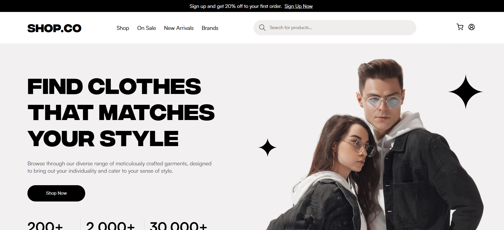

# SHOP-CO  

 <!-- Adicione uma imagem de banner se tiver -->  

SHOP-CO é uma landing page moderna e responsiva para uma plataforma de e-commerce, desenvolvida com React. O projeto foi criado para apresentar os principais produtos e funcionalidades de forma visualmente atraente e intuitiva.  

## 🚀 Como Executar o Projeto  

Siga os passos abaixo para rodar o projeto localmente.  

### 📌 Pré-requisitos  
- [Node.js](https://nodejs.org/) (v16 ou superior)  
- [Git](https://git-scm.com/) (opcional, mas recomendado)  

### 🛠️ Passos  
1. **Clone o repositório**:  
   ```bash  
   git clone https://github.com/seu-usuario/SHOP-CO.git  
   cd SHOP-CO  
   ```  
2. **Instale as dependências**:  
   ```bash  
   npm install  
   ```  
3. **Inicie o servidor de desenvolvimento**:  
   ```bash  
   npm start  
   ```  
4. **Acesse o projeto**:  
   Abra o navegador e acesse [http://localhost:3000](http://localhost:3000).  

## 🛠️ Tecnologias Utilizadas  

- **Frontend**  
  - React  
  - React Icons (para ícones)  
  - CSS puro (para estilos)  

- **Ferramentas**  
  - Git (controle de versão)  
  - ESLint (padronização de código)  
  - Prettier (formatação de código)  

## 📂 Estrutura do Projeto  

Aqui está uma visão geral da estrutura de pastas do projeto:  

```
SHOP-CO/  
├── public/                # Arquivos estáticos (imagens, ícones, etc.)  
├── src/                   # Código-fonte do projeto  
│   ├── assets/            # Imagens e recursos estáticos  
│   ├── components/        # Componentes reutilizáveis  
│   ├── pages/             # Páginas principais do site  
│   ├── App.js             # Componente principal  
│   └── index.js           # Ponto de entrada da aplicação  
├── .gitignore             # Arquivos ignorados pelo Git  
├── package.json           # Dependências e scripts do projeto  
└── README.md              # Este arquivo  
```

## 🎨 Funcionalidades  

✅ **Design Moderno**  
- Layout limpo e visualmente atraente.  
- Foco na experiência do usuário.  

✅ **Seções Principais**  
- Apresentação dos produtos mais populares.  
- Depoimentos de clientes.  
- Seção de marcas parceiras.  
- Formulário de contato.  

✅ **Responsividade**  
- Design adaptável para dispositivos móveis, tablets e desktops.  

✅ **Otimizações**  
- Código organizado e reutilizável.  
- Boas práticas de acessibilidade aplicadas.  

## 🤝 Créditos  

Este projeto foi desenvolvido com base no design criado por **Hamza Naeem**.  
Agradeço imensamente pela incrível contribuição e pelo design inspirador!  

## 📄 Licença  

Este projeto está sob a licença **MIT**. Veja o arquivo `LICENSE` para mais detalhes.  

**Feito com ❤️ por [Vera Lucia Perazza](https://github.com/perazzavera)**

